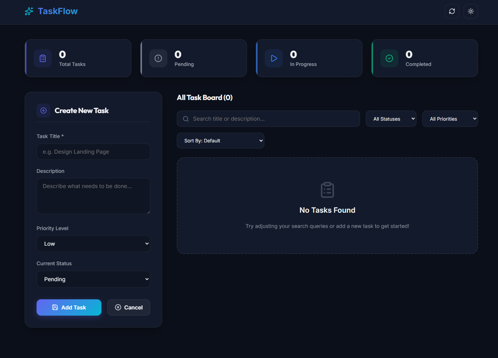

# Task Management System

## README / Documentation

The Task Management System is a full stack web application developed to manage daily tasks efficiently through a responsive and user-friendly interface. The project was built using React.js for the frontend, Spring Boot for the backend, and PostgreSQL as the database.

The application allows users to create, view, update, and delete tasks while also managing task priorities and statuses. The frontend communicates with the backend through REST APIs, and the backend handles database operations using Spring Data JPA and Hibernate.

The project follows a decoupled frontend-backend architecture and is deployed using modern cloud platforms.

---

# Technologies Used

- React.js
- Vite
- Axios
- Java
- Spring Boot
- Spring Data JPA
- Hibernate
- PostgreSQL
- Supabase
- Vercel
- Render

---

# Steps to Run the Project

## Backend Setup

```bash
cd taskmanager
mvn spring-boot:run
```

Backend runs on:

```text
http://localhost:8080
```

---

## Frontend Setup

```bash
cd taskmanager-frontend
npm install
npm run dev
```

Frontend runs on:

```text
http://localhost:5173
```

---

# Features Implemented

- Create Task
- View All Tasks
- Get Task By ID
- Update Task
- Delete Task
- Task Priority Management
- Task Status Tracking
- Responsive User Interface
- REST API Integration
- PostgreSQL Database Integration
- Frontend and Backend Deployment
- GitHub Version Control

---

# Challenges Faced

- Understanding frontend and backend integration
- Configuring REST API communication
- Solving CORS issues
- Connecting Spring Boot with PostgreSQL
- Deploying backend services on cloud platforms
- Handling deployment build issues

---

# What I Learned During the Challenge

- Full stack application development
- Building REST APIs using Spring Boot
- Database integration using Spring Data JPA
- React component-based architecture
- API communication using Axios
- Cloud deployment using Vercel and Render

---

# Screenshots

## Dashboard



---

## Create a New Task


---

## Update Task


---

## Filter by Priority


---

## Filter by Status


---

## Sorting the Tasks


---

# Deployment Links

## Frontend
https://task-management-system-tanj.vercel.app/

## Backend
https://taskmanager-backend-wct1.onrender.com
